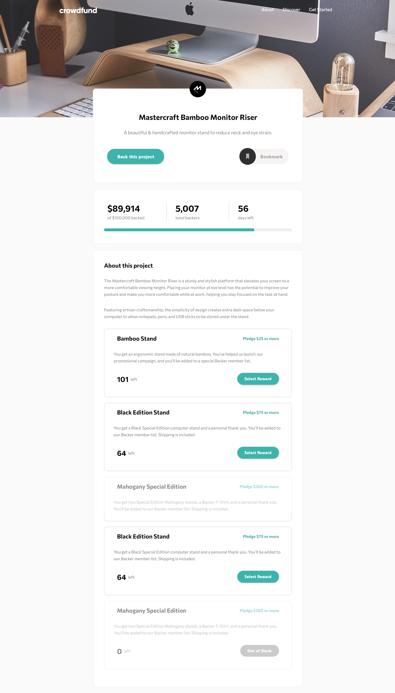

# Frontend Mentor - Crowdfunding product page solution

My solution to the [Crowdfunding product page challenge on Frontend Mentor](https://www.frontendmentor.io/challenges/crowdfunding-product-page-7uvcZe7ZR). Frontend Mentor challenges help you improve your coding skills by building realistic projects. 

## Table of contents

- [Overview](#overview)
  - [The challenge](#the-challenge)
  - [Screenshot](#screenshot)
  - [Links](#links)
  - [Built with](#built-with)
  - [Useful resources](#useful-resources)

## Overview

### The challenge

Users should be able to:

- View the optimal layout depending on their device's screen size
- See hover states for interactive elements
- Make a selection of which pledge to make
- See an updated progress bar and total money raised based on their pledge total after confirming a pledge
- See the number of total backers increment by one after confirming a pledge
- Toggle whether or not the product is bookmarked

### Screenshot

### Links

<!-- - Live Site URL: [Add live site URL here](https://your-live-site-url.com) -->

### Built with

- VueJs[https://vuejs.org/]
- MaterializeCss[https://materializecss.com/]
- CSS custom properties
- Flexbox
- JQuery

### Useful resources

- [Css-Tricks](https://css-tricks.com/) - for css obviously, gives some cool workaround for styling things I didn't know could be customized :D  
- [Stack Overflow](https://stackoverflow.com/) - Useful discussions when stuck on some logic, mostly on js topics.
